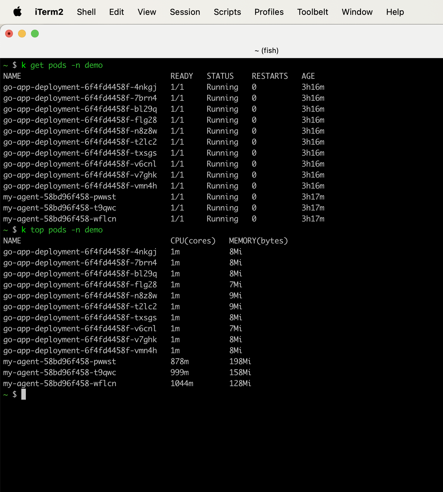

# agent-load-test

### Prepare test system

1. Install Kind Cluster. [(Ref)](https://kind.sigs.k8s.io/docs/user/quick-start/)

2. Install Agent Helm chart with custom values if needed. [(Ref)](https://github.com/optimizely/optimizely-agent-helm)

```bash
helm install --values myvalues.yaml my-agent optimizely-agent/agent --version [CURRENT_VERSION]
```

one example values file are given.

3. Install Kube Prometheus Stack for monitoring pod resources. [(Ref)](https://github.com/prometheus-community/helm-charts/tree/main/charts/kube-prometheus-stack)

```bash
helm repo add prometheus-community https://prometheus-community.github.io/helm-charts
helm repo update
helm install [RELEASE_NAME] prometheus-community/kube-prometheus-stack
```

4. Install metrics server to get pod resource consumption using kubectl. [(Ref)](https://github.com/kubernetes-sigs/metrics-server)

```
kubectl apply -f https://github.com/kubernetes-sigs/metrics-server/releases/latest/download/components.yaml
```


### Result

#### Config:

Log level: info

Polling interval: 30s

CPU Limit: 2 Core per pod

Memory Limit: 1 Gi per pod

Here 10 pods (go-app-deployment-*******) are calling /decide api after each 100 ms.


#### Config:

Log level: debug

Polling interval: 30s

CPU Limit: 2 Core per pod

Memory Limit: 1 Gi per pod

Here 10 pods (go-app-deployment-*******) are calling /decide api after each 100 ms.




#### Config:

Log level: error

Polling interval: 30s

CPU Limit: 2 Core per pod

Memory Limit: 1 Gi per pod

Here 10 pods (go-app-deployment-*******) are calling /decide api after each 100 ms.


#### Config:

Log level: error

Polling interval: 30s

CPU Limit: 500 millicore per pod

Memory Limit: 1 Gi per pod

Here 10 pods (go-app-deployment-*******) are calling /decide api after each 100 ms.


